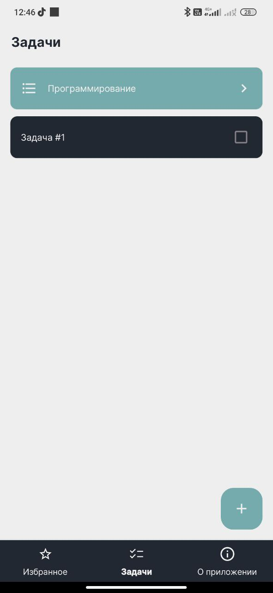
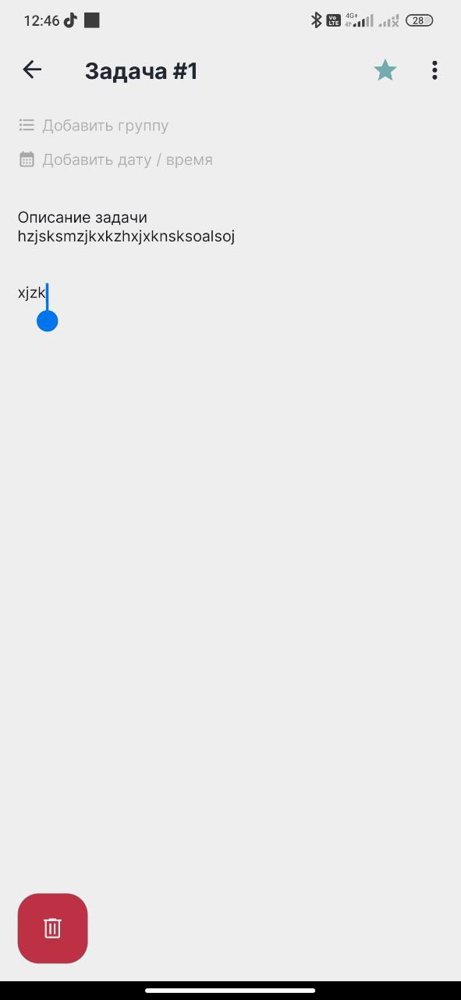

# Tasks 

**Tasks** is a simple to-do application built as a side project for learning purposes. It was created to explore modern Android development technologies and architectural patterns.

## Screenshots

  
  

## Technologies and Architecture
- **MVVM** – Model-View-ViewModel pattern for UI separation
- **Clean Architecture** – Layered project structure for maintainability and scalability
- **Kotlin** – Main programming language
- **Android View** – Classic UI layout system (XML-based)
- **Navigation Component** – Manages navigation and screen transitions
- **Kotlin Coroutines** – Asynchronous programming support
- **LiveData** – Reactive streams for data handling
- **Room** – Local database
- **Koin** – Dependency injection